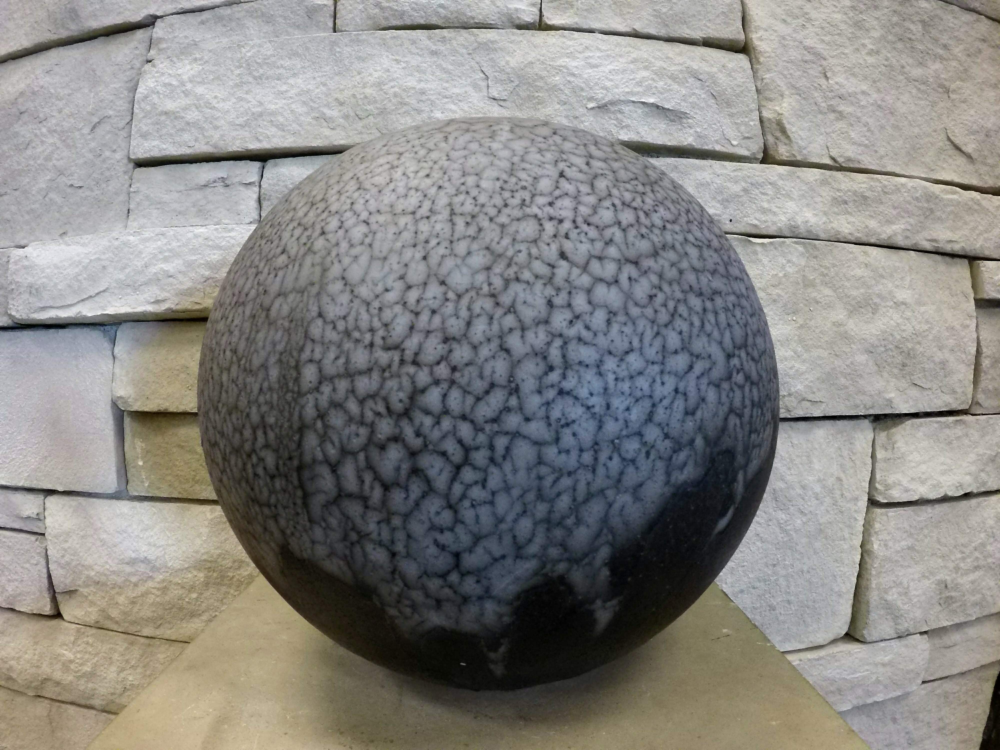

<html>
<title>E.Y.E Ceramics</title>
<body>
<h>E.Y.E Ceramics

</h>
	

Raku ware is an alternative a low fire technique that originated in Japan. My custom ceramic pieces have been glazed and fired to a cone 06 bisque temperature. I am currently working w/ naked raku, horse hair raku, and glazed raku firings. They are capable of holding liquid, but NOT recommended for consumable liquids and food. These pieces are fired in a propane fueled kiln that has been exposed to lead based glazes. Lead can be toxic for human consumption and cause serious health issues and possibly death if used for serving food and water. This method of firing is used for HOME DECOR ONLY. 

<h>naked raku</h>
</body>
</html>		
